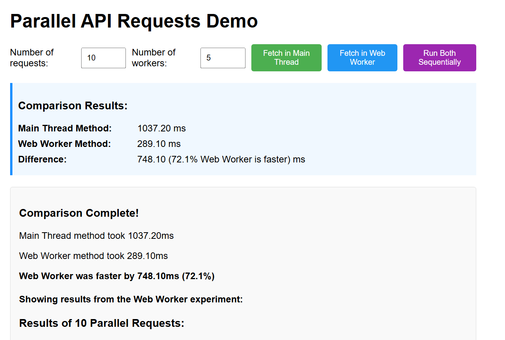

# Parallel API Requests Demo

This project demonstrates the performance benefits of using Web Workers for parallel API calls. It compares the execution time of making multiple API requests directly in the main thread versus distributing them across multiple Web Workers.

## Sample Results

Below is an example of how the experiment looks when running in the browser:



As shown in the screenshot, Web Workers can significantly outperform the main thread for parallel API requests (in this example by 72.1%).

## Project Structure

```
src/
  client/       # Frontend application code
  server/       # Backend Express server
```

## Features

- Make parallel API calls directly in the main thread
- Make parallel API calls distributed across multiple Web Workers
- Compare performance between the two approaches
- Configure the number of API requests (up to 50) and Web Workers (up to 16)
- View detailed performance metrics including end-to-end execution time

## Getting Started

### Prerequisites

- Node.js (version 14 or higher recommended)

### Installation

1. Clone this repository
2. Install server dependencies:
   ```
   cd src/server
   npm install
   ```

### Running the Application

1. Start the server:
   ```
   cd src/server
   node index.js
   ```
2. Navigate to http://localhost:3000 in your browser
3. Use the interface to:
   - Set the number of requests (1-50)
   - Set the number of workers (1-16)
   - Run tests using either the main thread, Web Workers, or compare both approaches

## How It Works

The application makes multiple API calls to a simple endpoint and measures the performance difference between:

1. Making all requests in parallel on the main thread
2. Distributing requests across multiple Web Workers

The performance metrics displayed include:
- End-to-end execution time
- Comparison between main thread and Web Worker methods
- Time difference between the approaches

See the individual README files in each directory for more details on the components:
- [Client README](src/client/README.md)
- [Server README](src/server/README.md)